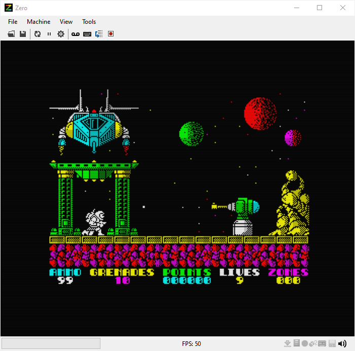

# Zero - A ZX Spectrum Emulator
Zero is a spectrum emulator written entirely on the .NET platform, using C#, and requires .NET framework 4.7 or above.

The philosophy behind Zero is to provide a highly accurate emulation of the various Spectrum models while also providing a nice, user friendly experience. 



## Features 
* Emulates the 48k, 128k, 128k SE, the Spectrum +2 and the Spectrum +3 (with 2 disk drives), and the Pentagon 128k models.

* Supports the following tape formats: TZX, TAP, CSW, and PZX. It only saves .TAP files though.

* Supports the following snapshot formats: SZX, SNA, and the Z80. It can save to SNA and SZX formats.

* Supports the following disk formats: DSK, TRD and SCL.

* Supports the playback and recording (with rollback) of RZX files.

* Supports the AY-3-8192 sound chip and ULA Plus.
  
* Supports the Kempston, Cursor and Sinclair joystick as well as the Kempston mouse. 

* There is a built-in debugger with modern conveniences like step-in, step-over, logging and breakpoint facilities.

* Other stuff: Virtual tape drive, POK file support, Zip file support, et al.
  

## Using the Emulator
The entire emulator is controlled and configured via the menu bar at the top. Additional options are under the Tools section in the menu.

## Using the Keyboard
Zero emulates the speccy keyboard faithfully and provides some additional functionality via the PC keyboard.

The Shift Keys on the PC keyboard act as Caps Shift for the speccy, while the Control keys act as Symbol Shift. 
For example, to enter LOAD "" on Zero: First press J to bring up the LOAD keyword and then press Ctrl+P twice (J, Ctrl+P, Ctrl+P).

To enter extended mode press Shift and Ctrl key together.

In addition, you can type in symbols like + , - ? etc directly from the PC keyboard as usual. Of course, the normal speccy entry method will work as well.

If you're in the habit of forgetting what key does what on the speccy (like me!), I recommend you use the SEBasic ROM or the Gosh Wonderful for the 48k, which support full typing (i.e to do LOAD "" you would actually have to type it in one letter at a time like on the PC). 

The following key combinations are used by Zero:

**Emulator Window**

Shortcut Key    | Function  
----------------|-----------
F2              | Tape Browser
F3 		          | Debugger
F4		          | Search Infoseek
F5     		      | Pause Emulation
F6		          | Acquire/Release Mouse (May first need to enable mouse emulation in Options)
F7		          | New RZX Recording
F8	            | Finalise RZX Recording
F9		          | Stop RZX Recording
Ins / Tab		          | Insert RZX Bookmark
Del		          | Rollback RZX to previous bookmark
Alt+F8 		      | Discard RZX Recording
Alt+F4  	      | Exit emulator
Ctrl+F5		      | Reset Emulator
Alt+F6		      | Unacquire mouse
Ctrl+O   	      | Open File
Ctrl+S   	      | Save snapshot
Ctrl+Shift+S     | Save screenshot
Ctrl+K		        | Show 48k Keyboard helper
Alt+0           | 100% window size
Alt+ +   	      | Increase window size by 50% of original speccy size
Alt+ -   	      | Decrease window size by 50% of original speccy size
Alt+Enter 	    | Full screen toggle

**Debugger**

Shortcut Key    | Function  
----------------|-----------
F5		          | Resume Emulation
F10		          | Step Over
F11		          | Step In
F12 		        | Step Out
Alt+B		        | Show Breakpoints Editor
Alt+S		        | Show Machine State
Alt+V		        | Show Memory Viewer
Alt+R		        | Show Registers
Alt+L		        | Show Execution Log
Alt+P		        | Poke Memory


## Command line options
Zero can be fully configured via the command line by passing parameters in the following format:
```
zero [file][-option [value]]
```
The following options are available:

Option            | Parameters    | Function  
------------------|---------------|------------------------------------------------
-f                |               | Launches the emulator in full screen mode
-s                |               | Enables pixel smoothing
-v                |               | Enables vertical syncing
-g                |               | Use GDI instead of DirectX for rendering
-i                |               | Enables display interlacing (scanlines)
-l                |               | Enables late timings
-p                | ula+/ulaplus/grayscale/normal |  Selects a colour palette
-m                | 48k/128k/128ke/plus3/pentagon128k | Selects a spectrum machine model
-e                | 1 to 10       | Sets the emulation speed (1 = Normal)
-c                | 1/2/4/8/14    | CPU Multiplier (3.5 MHz * multiplier)
-w                | multiples of 50 | Selects a window size as a percentage increment of speccy size (0 = no increment, 50 = 50% increment, etc)
-b                | mini/medium/full | Sets the emulated border size
-q                | see below       |  Plays back commands in a queue

Available playback commands:
```
/loadfile "filename"    : Loads a file given the path
/waitframes N           : Waits for N frames before processing next command
/trace "filename"       : Starts a trace log to the given filename
/stoptrace              : Stops the above trace logging
/savesnap "filename"    : Saves the current emulation state as a snapshot
/debug                  : Opens the debugger
/exit                   : Exits the emulator
```

Examples:
1) Open the emulator in full screen, with scanlines and ULA+ palette enabled:
```
zero.exe -f -s -c ula+
```
1) Open a file, use late timings and enable mini borders:
```
zero.exe -q "exolon.pzx" -l -b mini
```
1) Open a file, wait for 2 frames, start trace logging, wait for 5 frames, stop the logging and shutdown emulator:
```
zero.exe -q "exolon.pzx" /waitframes 2 /startrace "exolon_trace.log" /waitframes 5 /stoptrace /exit
```

## Uninstalling Zero
If you installed the emulator using the Setup, simply run the uninstaller to uninstall the emulator.It's generally a good idea to uninstall a previous version of the emulator before installing a new one.

If you used the .zip version, simply delete the folder in which Zero resides.

## Building the project using source
The project currently uses Visual Studio 2019 Community edition (free). It may not be compatible with older Visual Studio editions. I recommend downloading VS 2019 Community as it's almost like the professional version (supports plugins for example) and is free to download from here: http://www.visualstudio.com/en-us/news/vs2013-community-vs.aspx


## Important
If you're unable to launch the emulator or the emulator crashes immediately on launching, you may need to install an additional DirectX component, which can be found here: http://www.microsoft.com/en-us/download/details.aspx?id=810

## Acknowledgements
Many thanks to Mark Woodmass (Woody) for his patient and detailed technical advice on various aspects of emulation, and to Rich Chandler, Paul Dunn (Dunny) and others on the ZX Spectrum discord group for their help and feedback. This emulator wouldn't have been possible otherwise without their considerable encouragement and support.

Thanks also to Patrik Rak for permission to use the various PZX conversion tools that Zero uses to support other tape format. You can find more information on them on Patrik's site: http://zxds.raxoft.cz/pzx.html.

Thanks to Alex Makeev for permission to use his DirectSound routines from ZXMAK 2.

Thanks go out to Dr. Phil Kendall and others for putting together the CSS FAQ, which helped me figure out some of the nuances of the Spectrum hardware and peripherals.

I must also thank my wife Poornima for putting up with my obsession with the speccy and even providing encouragement and help with this project!

Additional contributors whose feedback have helped in shaping the emulator are credited in the What's New file.

## License & Copyrights
Copyright (c) 2009-2024 Arjun Nair. See the LICENSE file for license rights and limitations (MIT).  
Zero uses various public domain icons. Copyright rests with their respective authors. 
