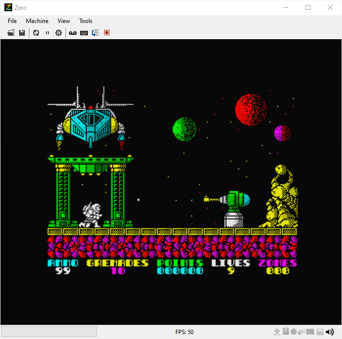

# Zero X - A cross platform ZX Spectrum emulator
Zero X is a cross platform port of the previous Windows only emulator. This version is based on Avalonia and SDL 3 and was ported using Claude AI. 

Note that much of the code is still my hand rolled one, over 10+ years, so any errors in emulation accuracy or feature implementation in this version are my own. 

The philosophy behind Zero X is to provide a highly accurate emulation of the various Spectrum models while also providing a modern, user friendly experience. 

Note: The terms Zero and Zero X are used interchangeably, but Zero X strictly refers to the cross platform emulator only.



## Cross-platform build (branch `crossplatform`)

Zero now builds and runs on Windows, macOS (Intel and Apple Silicon) and Linux with .NET 10, Avalonia and SDL3.

```bash
dotnet run --project src/Zero.App          # run the emulator
dotnet test tests/Zero.Core.Tests --filter "Category!=Zexall&Category!=Slow"
dotnet test tests/Zero.App.Tests           # headless UI tests
```

See [docs/porting-status.md](docs/porting-status.md) for what is in this build, what was cut for v1
(TZX/CSW, disks, debugger) and how it differs from the Windows-only original, and
[packaging/README.md](packaging/README.md) for self-contained builds.

## Features 
* Emulates the 48k, 128k, 128k SE, the Spectrum +2 and the Spectrum +3 (with 2 disk drives), and the Pentagon 128k models.

* Supports the following tape formats: TZX, TAP, CSW, and PZX. It only saves .TAP files though.

* Supports the following snapshot formats: SZX, SNA, and the Z80. It can save to SNA and SZX formats.

* Supports the following disk formats: DSK, TRD and SCL.

* Supports the playback and recording of RZX files, with bookmarks and rollback. Stopping and resuming of recordings is also supported.

* Supports the AY-3-8192 sound chip and ULA Plus.
  
* Supports the Kempston, Cursor and Sinclair joystick as well as the Kempston mouse. 

* There is a built-in debugger with modern conveniences like step-in, step-over, logging and breakpoint facilities.

* Other stuff: Virtual tape drive, POK file support, Zip file support, et al.
  

## Using the Emulator
The entire emulator is controlled and configured via the menu bar at the top. Additional options are under the Tools section in the menu.

### RZX recordings
Zero supports RXZ recordings. To playback one, simply open a `.rzx` file - the emulator will automatically start playing it back with the status bar showing`▶ RZX` while it runs. 

To make your own recording, use File > RZX Recording > Start Recording... The recording opens with a snapshot of the machine as it stands, so it replays on its own without the original snapshot or tape, and the status bar shows `● REC`.

Rollbacks while recording is also supported. F10 inserts a rollback bookmark and Shift+F10 rewinds the machine and the recording to the last one.

There are three ways to end a recording:

Menu item          | What it does
-------------------|-------------
Stop Recording     | Ends the session and leaves but allows continuing the recording later.
Finish Recording   | Finalizes the recording. No more changes can be done to the RZX file.
Discard Recording  | Throws away the recording and deletes the file.

Continue Recording... reopens a file left by Stop Recording and appends to it, so a long recording can be built over several sittings. 

## Using the Keyboard
Zero emulates the speccy keyboard faithfully and provides some additional functionality via the PC keyboard.

The Shift Keys on the PC keyboard act as Caps Shift for the speccy, while the Control keys act as Symbol Shift. 
For example, to enter LOAD "" on Zero: First press J to bring up the LOAD keyword and then press Ctrl+P twice (J, Ctrl+P, Ctrl+P).

To enter extended mode press Shift and Ctrl key together.

In addition, you can type in symbols like + , - ? etc directly from the PC keyboard as usual. Of course, the normal speccy entry method will work as well.

If you're in the habit of forgetting what key does what on the speccy (like me!), I recommend you use the SEBasic ROM or the Gosh Wonderful for the 48k, which support full typing (i.e to do LOAD "" you would actually have to type it in one letter at a time like on the PC). 

The following key combinations are used by Zero X. The `Cmd` rows are the Command key on macOS only:
on Windows and Linux the Control key is Symbol Shift for the Spectrum and nothing else, so there are no
Ctrl shortcuts there. The function keys do the same jobs on every platform.

Shortcut Key    | Function
----------------|-----------
F1              | Show the Spectrum keyboard helper
F2              | Save snapshot
F3              | Open file
F4              | Tape Deck
F5              | Tape play / stop
F6              | Tape rewind
F7              | Pause / resume emulation
F8              | Mute / unmute
F9              | Reset emulator
Shift+F9        | Hard reset
F10             | Insert an RZX rollback bookmark (while recording)
Shift+F10       | Roll back to the last bookmark (while recording)
F11             | Full screen toggle
F12             | Save screen as .scr
Pause           | Pause / resume emulation
Esc             | Release the captured Kempston mouse
Cmd+O           | Open file
Cmd+S           | Save snapshot
Cmd+R           | Reset emulator (add Shift for a hard reset)
Cmd+P           | Pause / resume emulation
Cmd+M           | Mute / unmute
Cmd+F           | Full screen toggle
Cmd+,           | Options
Cmd+Q           | Exit emulator

The Kempston mouse is captured by clicking on the screen, after enabling it under Input, and released with Esc.

Window size is chosen from View > Window Size; there is no shortcut for it. Options has no shortcut
outside macOS either, for the same reason as the rest of the Cmd set.

The debugger was cut for v1, so the shortcuts it used to own are gone.


## Command line options
Zero can be fully configured via the command line by passing parameters in the following format:
```
zero [file][-option [value]]
```
The following options are available:

Option            | Parameters    | Function  
------------------|---------------|------------------------------------------------
-f                |               | Launches the emulator in full screen mode
-s                |               | Enables pixel smoothing
-v                |               | Enables vertical syncing
-g                |               | Use GDI instead of DirectX for rendering
-i                |               | Enables display interlacing (scanlines)
-l                |               | Enables late timings
-p                | ula+/ulaplus/grayscale/normal |  Selects a colour palette
-m                | 48k/128k/128ke/plus3/pentagon128k | Selects a spectrum machine model
-e                | 1 to 10       | Sets the emulation speed (1 = Normal)
-c                | 1/2/4/8/14    | CPU Multiplier (3.5 MHz * multiplier)
-w                | multiples of 50 | Selects a window size as a percentage increment of speccy size (0 = no increment, 50 = 50% increment, etc)
-b                | mini/medium/full | Sets the emulated border size
-q                | see below       |  Plays back commands in a queue

Available playback commands:
```
/loadfile "filename"    : Loads a file given the path
/waitframes N           : Waits for N frames before processing next command
/trace "filename"       : Starts a trace log to the given filename
/stoptrace              : Stops the above trace logging
/savesnap "filename"    : Saves the current emulation state as a snapshot
/debug                  : Opens the debugger
/exit                   : Exits the emulator
```

Examples:
1) Open the emulator in full screen, with scanlines and ULA+ palette enabled:
```
zero.exe -f -s -c ula+
```
1) Open a file, use late timings and enable mini borders:
```
zero.exe -q "exolon.pzx" -l -b mini
```
1) Open a file, wait for 2 frames, start trace logging, wait for 5 frames, stop the logging and shutdown emulator:
```
zero.exe -q "exolon.pzx" /waitframes 2 /startrace "exolon_trace.log" /waitframes 5 /stoptrace /exit
```

## Uninstalling Zero

Simply delete the folder in which Zero resides.


## Acknowledgements
Many thanks to Mark Woodmass (Woody) for his patient and detailed technical advice on various aspects of emulation, and to Rich Chandler, Paul Dunn (Dunny) and others on the ZX Spectrum discord group for their help and feedback. This emulator wouldn't have been possible otherwise without their considerable encouragement and support.

Thanks also to Patrik Rak for permission to use the various PZX conversion tools that Zero uses to support other tape format. You can find more information on them on Patrik's site: http://zxds.raxoft.cz/pzx.html.

Thanks to Alex Makeev for permission to use his DirectSound routines from ZXMAK 2.

Thanks go out to Dr. Phil Kendall and others for putting together the CSS FAQ, which helped me figure out some of the nuances of the Spectrum hardware and peripherals.

I must also thank my wife Poornima for putting up with my obsession with the speccy and even providing encouragement and help with this project!

Additional contributors whose feedback have helped in shaping the emulator are credited in the What's New file.

## License & Copyrights
Copyright (c) 2009-2026 Arjun Nair. See the LICENSE file for license rights and limitations (MIT).  
Zero uses various public domain icons. Copyright rests with their respective authors. 
